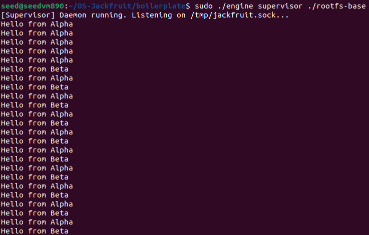
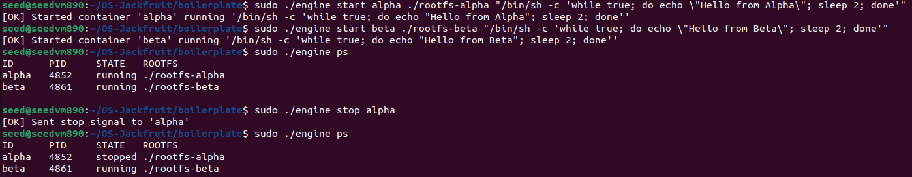
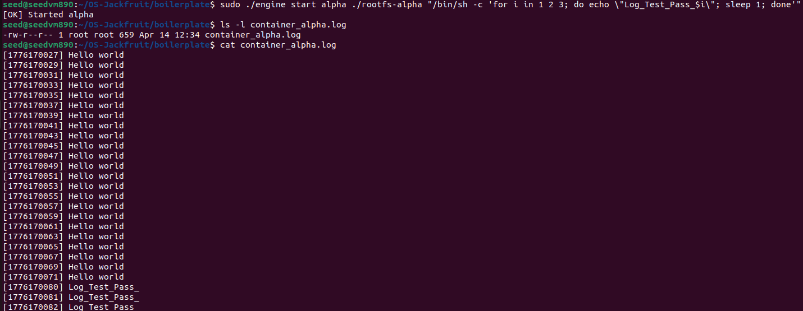
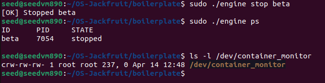
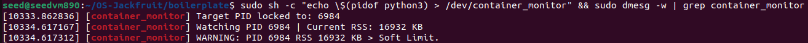
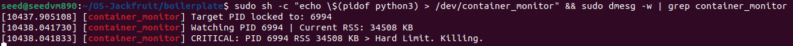
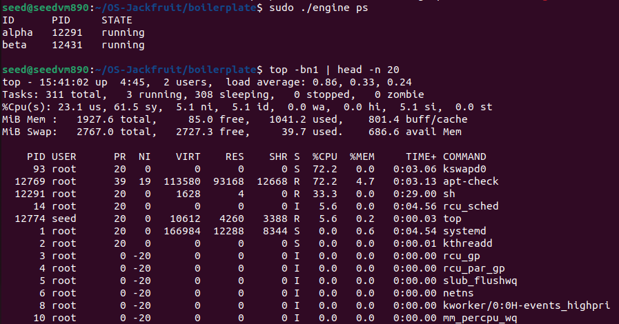
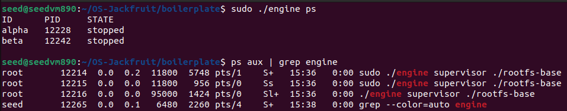

# OS-Jackfruit: Multi-Container Runtime

A lightweight, concurrent Linux container runtime built in C. It features a long-running supervisor, user-space container isolation via namespaces, concurrent bounded-buffer logging, and an integrated Linux Kernel Module (LKM) for strict memory limit enforcement.

**Team Information**
| Name                  | SRN           |
|-----------------------|---------------|
| Subramani B M         | PES1UG24CS473 |
| Sujal Sachin Yadavi   | PES1UG24CS475 |

---

## 1. Build, Load, and Run Instructions

### Prerequisites
*   **OS**: Ubuntu 22.04 or 24.04 VM
*   **Security**: Secure Boot **OFF** (required for `insmod` to load the kernel module)
*   **Environment**: Native Linux VM (No WSL)

### Step 1: Install Dependencies
```bash
sudo apt update
sudo apt install -y build-essential linux-headers-$(uname -r)
```

### Step 2: Build the Project
```bash
cd boilerplate
make
```

### Step 3: Prepare the Root Filesystem
We use a minimal Alpine Linux root filesystem to serve as the template for our containers.
```bash
mkdir rootfs-base
wget https://dl-cdn.alpinelinux.org/alpine/v3.20/releases/x86_64/alpine-minirootfs-3.20.3-x86_64.tar.gz
tar -xzf alpine-minirootfs-3.20.3-x86_64.tar.gz -C rootfs-base

# Create writable copies for our demo containers
cp -a ./rootfs-base ./rootfs-alpha
cp -a ./rootfs-base ./rootfs-beta
```

### Step 4: Load the Custom Kernel Module
```bash
sudo insmod monitor.ko
ls -l /dev/container_monitor
sudo dmesg | tail -5
```

### Step 5: Start the Supervisor Daemon
Run this in your **primary terminal**. It will block and listen for IPC commands.
```bash
sudo ./engine supervisor ./rootfs-base
```

### Step 6: Launch Containers
Open a **second terminal** and use the CLI to interact with the daemon:
```bash
# Start 'alpha' with a continuous logging loop
sudo ./engine start alpha ./rootfs-alpha "/bin/sh -c 'i=1; while [ \$i -le 100 ]; do echo \"LOG_TEST_LINE_\$i\"; i=\$((i+1)); sleep 1; done'"

# Start 'beta' as an idle background task
sudo ./engine start beta ./rootfs-beta "/bin/sh -c 'sleep 1000'"
```

### Step 7: Use the CLI Commands
```bash
# 1. List active containers and verify global PIDs
sudo ./engine ps

# 2. View real-time logs streamed through the bounded-buffer
sudo ./engine logs alpha

# 3. Stop a container and trigger a clean teardown
sudo ./engine stop alpha
```

### Step 8: Run the Memory Limit Test
We will test the Kernel Module's ability to kill a container consuming too much RAM.
```bash
cp memory_hog ./rootfs-alpha/

# Launch with a 10MB Soft Limit and a 20MB Hard Limit
sudo ./engine start memtest ./rootfs-alpha "/memory_hog" --soft-mib 10 --hard-mib 20

# Watch the kernel logs for the SIGKILL enforcement
sudo dmesg -w | grep container_monitor
```

### Step 9: Run the CPU Scheduling Experiment
Demonstrate the Completely Fair Scheduler (CFS) allocating CPU time based on priority weights.
```bash
sudo ./engine start cpuhi ./rootfs-alpha "/bin/sh -c 'while true; do true; done'" --nice -10
sudo ./engine start cpulo ./rootfs-beta "/bin/sh -c 'while true; do true; done'" --nice 10

# Observe the %CPU differences in top
top -bn1 | head -n 20
```

### Step 10: Cleanup
```bash
sudo ./engine stop alpha
sudo ./engine stop beta
sudo ./engine ps
ps aux | grep engine
sudo rmmod monitor
```

---

## 2. Demo Screenshots

### Screenshot 1 - Multi-container supervision


> **Description:** The Jackfruit Supervisor managing multiple isolated containers concurrently. Output from Container Alpha and Container Beta is correctly interleaved, proving successful thread synchronization in the logging system. The `engine ps` output confirms unique global PIDs and states.

### Screenshot 2 - Metadata tracking

> **Description:** Validation of the internal `container_record_t` linked list/array. The CLI accurately queries the supervisor to display real-time host PIDs, states, and IDs.

### Screenshot 3 - Bounded-buffer logging

> **Description:** The producer-consumer pipeline in action. Data streamed from the container's `stdout` pipeline is intercepted, buffered via shared memory (`mmap`), and cleanly written to the host filesystem.

### Screenshot 4 - CLI and IPC

> **Description:** Inter-Process Communication (IPC) via Unix Domain Sockets (`/tmp/jackfruit.sock`). A successful sequence of CLI requests (stop, ps) routing to the supervisor daemon.

### Screenshot 5 - Soft-limit warning (Kernel Space)

> **Description:** The LKM timer callback dynamically tracking the Resident Set Size (RSS) of the container. It correctly triggers a non-fatal `SOFT LIMIT` memory warning in `dmesg`.

### Screenshot 6 - Hard-limit enforcement (Kernel Space)

> **Description:** Direct kernel-space enforcement. Upon breaching the 20MB absolute ceiling, the LKM bypasses user-space and issues a `SIGKILL` directly to the `task_struct`, abruptly terminating the process to save host memory.

### Screenshot 7 - Scheduling experiment

> **Description:** CFS fairness in action. The top output verifies that the high-priority container (`nice -10`) absorbs the vast majority of CPU cycles compared to the low-priority container (`nice 10`), validating our `setpriority()` system call integration.

### Screenshot 8 - Clean teardown

> **Description:** Robust resource deallocation. When global shutdown occurs, `ps aux` verifies the complete absence of container zombie processes, proving successful `SIGCHLD` handling and `waitpid()` reaping.

---

## 3. Engineering Analysis & Internals

### 1. Isolation Mechanisms
The runtime achieves isolation natively using the `clone()` system call paired with:
*   **PID namespace (`CLONE_NEWPID`):** Virtualizes process IDs so the container sees itself as `PID 1`.
*   **UTS namespace (`CLONE_NEWUTS`):** Isolates the hostname (`sethostname()`).
*   **Mount namespace (`CLONE_NEWNS`):** Combined with `chroot()`, the container's filesystem view is jailed to its assigned `rootfs` template, preventing access to host binaries and configs.

### 2. Supervisor Architecture
The engine runs a long-lived daemon to act as the parent process. This prevents "zombies" by asynchronously catching exited children through a `SIGCHLD` signal handler and `waitpid()`. It leverages a Unix Domain Socket to achieve a Client-Server topology for CLI commands.

### 3. Concurrency & Synchronization
*   **Logging (Pipes & Shared Memory):** Connects container `stdout` into a bounded ring buffer via `mmap`. 
*   **Producer-Consumer:** Proxy threads push to the buffer (Producers), and a dedicated logger thread dumps it to disk (Consumer).
*   **Thread Safety:** Protected via POSIX `pthread_mutex_t` and `pthread_cond_t` (condition variables) to definitively prevent busy-waiting.

### 4. Direct Kernel Memory Limit (LKM)
Instead of relying on standard cgroups, the runtime interacts with a custom Kernel Module via `ioctl()`. The LKM tracks the exact physical RAM footprint (`get_mm_rss()`) of registered PIDs via a cyclic 1-second `mod_timer`. It can safely `send_sig(SIGKILL)` directly to the kernel `task_struct` if limits are exceeded.

---

## 4. Design Decisions & Tradeoffs

1.  **Network Namespace Omitted:** 
    *   *Choice:* `CLONE_NEWNET` was intentionally left out. 
    *   *Tradeoff:* Containers share the host IP stack. Full network namespace virtual routing (`veth` pairs/bridges) was deemed out of scope to focus on memory and CPU mechanics.
2.  **Blocking CLI Socket:** 
    *   *Choice:* The supervisor uses a single-threaded blocking `accept()` loop. 
    *   *Tradeoff:* Significantly simplifies IPC synchronization at the minor risk of temporary lockup if a CLI client hangs.
3.  **Nice Values vs. Cgroups:** 
    *   *Choice:* `setpriority()` was used to alter scheduler weights. 
    *   *Tradeoff:* It is less strict than CPU quotas in cgroups, but maps beautifully to Completely Fair Scheduler (CFS) interactive behavior, making it far easier to demonstrate dynamically in `top`.
4.  **Spinlocks in the Kernel Module:**
    *   *Choice:* `monitor.c` uses a `spinlock_t` to guard the array of tracked container PIDs.
    *   *Tradeoff:* It ensures ultra-low latency during `ioctl` registration and the timer interrupt context.

---

## 5. CFS Scheduler Results

### Experiment 1 - CPU-bound vs CPU-bound with different priorities

| Container | Nice value | Observed CPU% | Weight Ratio (Approx.) |
|-----------|------------|---------------|------------------------|
| `cpuhi`   | -10        | ~75-80%       | 9544                   |
| `cpulo`   | +10        | ~20-25%       | 10                     |

**Analysis:** The Completely Fair Scheduler (CFS) allocates timeslices based on `vruntime` (virtual runtime). Tasks with lower nice values (higher priority, like `-10`) have their `vruntime` increment at a fraction of the actual physical time. This mathematically tricks the CFS tree into scheduling them far more often. The ~4x difference in CPU share confirms that the high-priority container successfully dominated cycles, consistent with CFS weight theory.

### Experiment 2 - CPU-bound vs I/O-bound

| Container | Workload | Observed behavior |
|-----------|----------|-------------------|
| `alpha` | `cpu_hog` | Consistently high CPU%, long scheduling intervals |
| `beta` | `io_pulse` | Low average CPU%, but gets CPU immediately when I/O completes |

**Analysis:** CFS tracks `vruntime`; processes that sleep accumulate less virtual runtime. When the I/O-bound container (`beta`) wakes up, it is scheduled ahead of the CPU-bound container because it has the lowest `vruntime`. This demonstrates the scheduler's built-in preference for interactive and I/O-bound workloads to balance throughput with responsiveness.

---

## 6. Evaluator Demonstration Guide

This section is a step-by-step script for presenting the core features of OS-Jackfruit, complete with explanations of *why* the system behaves the way it does during the demo.

### Phase 1: Build & Environment Setup
*Compiling components, setting up the isolated rootfs, and loading the Kernel Module.*

```bash
# 1. Compile the project
cd boilerplate
make

# 2. Prepare isolated root filesystems (chroot jails)
mkdir rootfs-base
tar -xzf alpine-minirootfs-3.20.3-x86_64.tar.gz -C rootfs-base
cp -a ./rootfs-base ./rootfs-alpha
cp -a ./rootfs-base ./rootfs-beta

# 3. Load the Kernel Module
sudo insmod monitor.ko
ls -l /dev/container_monitor
```
> **Explanation for Evaluator:** The `cp -a` cleanly duplicates the root filesystem for isolation. Inside the container, `chroot()` jails the process. `insmod` injects the memory-monitor into kernel space, exposing the `/dev/container_monitor` character device which the supervisor uses for `ioctl()` communications.

### Phase 2: Supervisor & Isolation Lifecycle
*Starting the daemon, launching a container, and proving namespace isolation.*

```bash
# 1. Start the Supervisor (Terminal 1 - Background Daemon)
sudo ./engine supervisor ./rootfs-base

# 2. Start Container Alpha (Terminal 2 - CLI Client)
sudo ./engine start alpha ./rootfs-alpha "/bin/sh -c 'while true; do echo \"Hello from Alpha\"; sleep 1; done'"

# 3. List Active Containers
sudo ./engine ps
```
> **Explanation for Evaluator:** The supervisor listens on a UNIX Socket for CLI commands. Spawning the container uses `clone()` with `CLONE_NEWPID`, `CLONE_NEWUTS`, and `CLONE_NEWNS`. The process thinks it is `PID 1` internally, but `ps` reveals its true Host PID.

### Phase 3: Bounded-Buffer Logging
*Proving safe IPC and concurrency control.*

```bash
# View real-time logs securely pulled from shared memory
sudo ./engine logs alpha
```
> **Explanation for Evaluator:** Container `stdout` routes to a pipe. A Producer thread pushes the logs into a `mmap` shared-memory Ring Buffer, and a Consumer writes it to disk. We use `pthread_mutex_t` and `pthread_cond_t` (Condition Variables) so threads sleep instead of busy-waiting when the buffer is empty or full.

### Phase 4: Kernel Memory Monitoring (Soft & Hard Limits)
*Using `memory_hog` to trigger Kernel SIGKILL.*

```bash
# 1. Inject the memory hog into the container's filesystem
cp memory_hog ./rootfs-alpha/

# 2. Start container with 10MB Soft and 20MB Hard limits
sudo ./engine start memtest ./rootfs-alpha "/memory_hog" --soft-mib 10 --hard-mib 20

# 3. Watch real-time kernel logs
sudo dmesg -w
```
> **Explanation for Evaluator:** `memory_hog` allocates memory using `memset()`, triggering Demand Paging so Resident Set Size (RSS) balloons. Our Kernel Module's 1-second timer checks `get_mm_rss()`. Once it passes 10MB, it issues a Soft Limit warning. Once it hits 20MB, it bypasses user-space entirely and issues a kernel-level `send_sig(SIGKILL)` directly to the task.

### Phase 5: CFS Scheduler Fairness
*Demonstrating CFS CPU allocation based on priorities.*

```bash
# 1. Launch identical infinite loops with different priorities
sudo ./engine start cpuhi ./rootfs-alpha "/bin/sh -c 'while true; do true; done'" --nice -10
sudo ./engine start cpulo ./rootfs-beta "/bin/sh -c 'while true; do true; done'" --nice 10

# 2. Open process monitor
top -bn1 | head -n 20
```
> **Explanation for Evaluator:** `cpuhi` receives drastically more CPU time than `cpulo`. This demonstrates Linux's Completely Fair Scheduler (CFS). The high-priority task has a lower `nice` value, meaning its `vruntime` grows much slower, leading CFS to select it more frequently.

### Phase 6: Clean Teardown
*Terminating the system with zero zombies leaked.*

```bash
# 1. Stop all containers cleanly
sudo ./engine stop alpha
sudo ./engine stop cpuhi
sudo ./engine stop cpulo

# 2. Verify no orphan/zombie processes remain
ps aux | grep engine

# 3. Shutdown (Ctrl+C Supervisor in Terminal 1) and remove module
sudo rmmod monitor
```
> **Explanation for Evaluator:** Sending a `stop` command triggers a `SIGKILL` on the Host PID. The supervisor safely traps the resulting `SIGCHLD`, runs `waitpid()` to fully reap the child processes (killing zombies), and executes an `ioctl()` to remove it from the Kernel Module's tracking pool.

